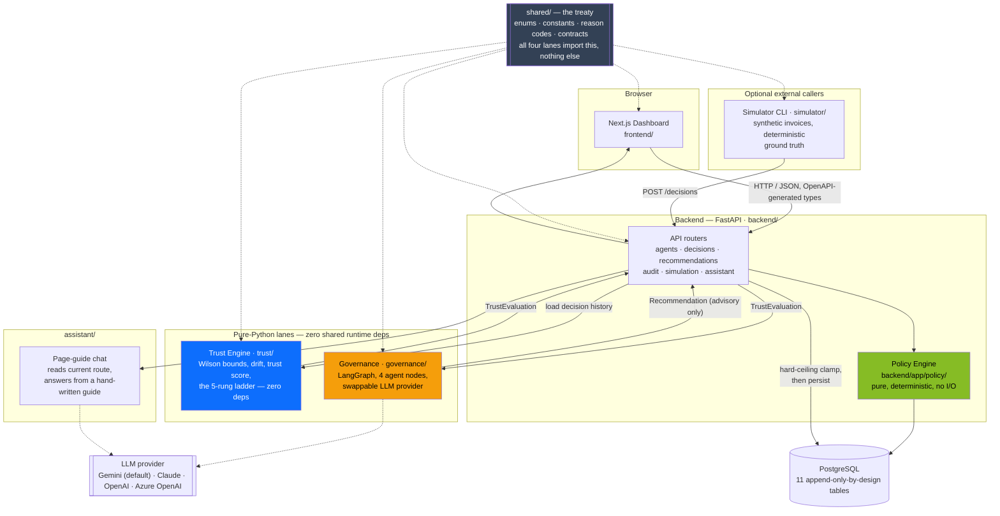
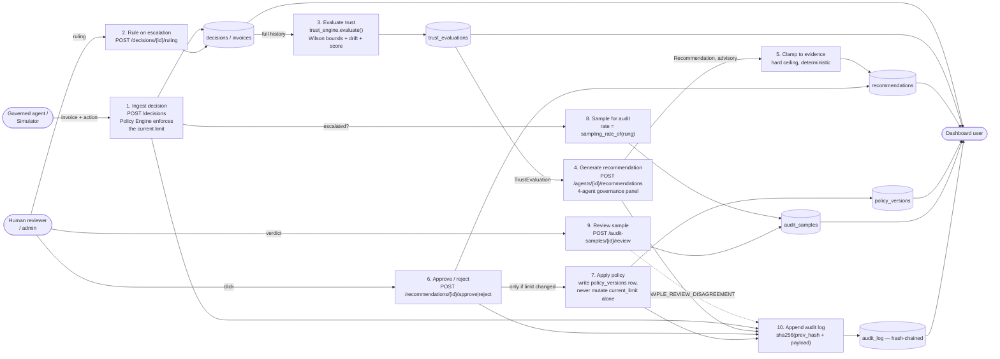
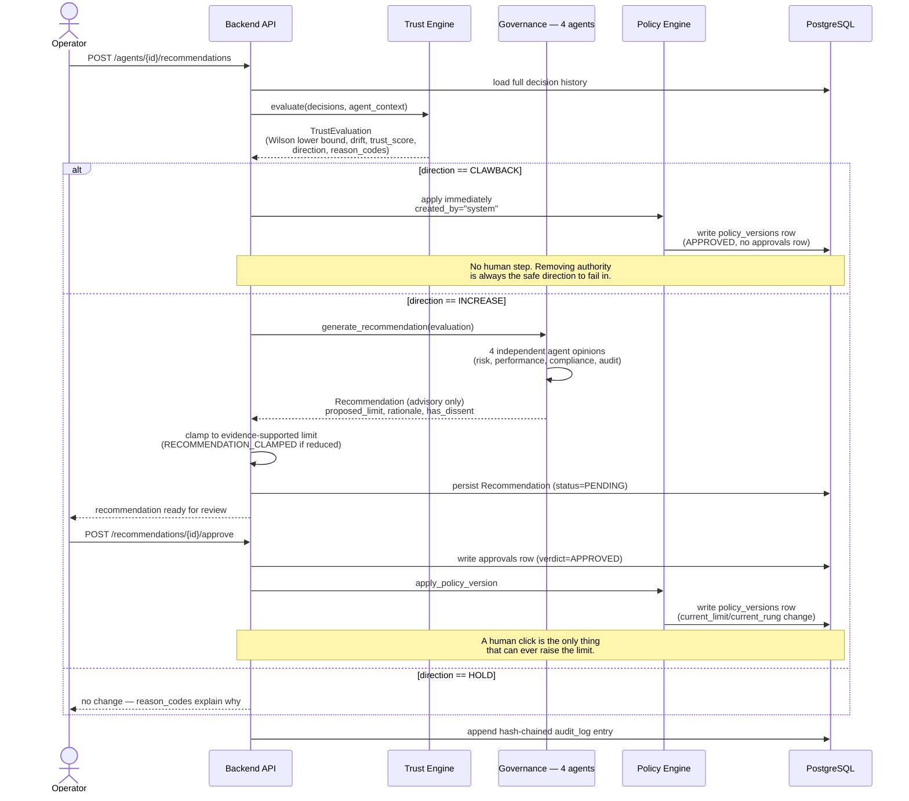
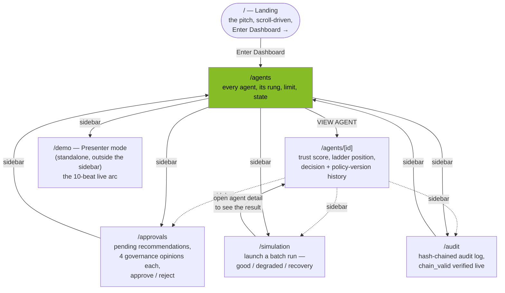
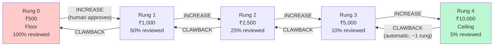

# Adaptive AI Governance Platform (AAGP)

**An AI agent approves invoices. It starts small, and earns the right to
decide on larger ones only when the numbers prove it — and loses that right
automatically the moment they stop proving it.**

> **LLM reasons. Statistics provide evidence. Policy Engine enforces. Humans
> authorize.**

That one sentence is the whole architecture. Four kinds of authority, never
allowed to blur into one another:

| Word | Means | Lives in |
|---|---|---|
| **Reasons** | Reads the evidence, writes a human-readable recommendation. Cannot act on its own conclusion. | `governance/` |
| **Provide evidence** | Pure arithmetic over the decision log — Wilson-bound accuracy, drift tests, a composed trust score. No LLM call, reproducible. | `trust/` |
| **Enforces** | The only code that actually changes a spending limit or blocks a decision. Deterministic. | `backend/app/policy/` |
| **Authorize** | A human's click, required before autonomy *increases*, never required to take it away. | Approvals UI → `POST /recommendations/{id}/approve` |

---

## Table of contents

- [The problem, and the answer](#the-problem-and-the-answer)
- [System architecture](#system-architecture)
- [Data flow](#data-flow)
- [The autonomy lifecycle, end to end](#the-autonomy-lifecycle-end-to-end)
- [User flow — the dashboard](#user-flow--the-dashboard)
- [The five-rung ladder](#the-five-rung-ladder)
- [The lanes](#the-lanes)
- [Shared contracts (`shared/`)](#shared-contracts-shared)
- [The 18 reason codes](#the-18-reason-codes)
- [API surface](#api-surface)
- [Database schema](#database-schema)
- [Tech stack](#tech-stack)
- [Getting it running](#getting-it-running)
- [Testing](#testing)
- [Project layout](#project-layout)
- [Why it's built this way — the ADRs](#why-its-built-this-way--the-adrs)
- [Honest limitations](#honest-limitations)
- [Where to go next](#where-to-go-next)

---

## The problem, and the answer

An AI agent decides whether to approve or reject invoices — a task where a
wrong `APPROVE` moves real money out the door and a wrong `REJECT` merely
annoys someone. The two failure directions are **not symmetric**, and the
whole system is built around that asymmetry rather than raw accuracy.

Two obviously-wrong starting points:

- **Unlimited authority on day one** — handing a brand-new, unvalidated
  agent the ability to approve anything is the exact failure every finance
  department already fears.
- **A permanent, unmovable cap** — if a genuinely reliable agent stays stuck
  approving nothing over ₹500 forever, the system bought safety by making
  itself useless.

**The answer:** autonomy is earned incrementally, on statistical evidence,
and can be taken back automatically. The agent starts at the floor. Every
decision becomes data. When the data is good enough — not just *looks* good,
but is *statistically proven* good at a given sample size — the system
recommends moving the agent one step up a fixed ladder. A human has to say
yes. If performance later degrades, the system claws the limit back with no
human needed, because removing authority is the safe direction to fail in
and granting it is not ([ADR-0004](docs/adr/0004-human-approval-required-for-autonomy-increases.md)).

The statistical core of that argument is the **Wilson lower bound**, not the
raw accuracy percentage — see [`docs/PRESENTATION-FACTS.md`](docs/PRESENTATION-FACTS.md)
for the real, independently-recomputed numbers:

| Record | Point accuracy | Wilson lower bound |
|---|---:|---:|
| 5 / 5 | 100.0% | **56.6%** |
| 10 / 10 | 100.0% | **72.2%** |
| 50 / 50 | 100.0% | **92.9%** |
| 384 / 400 | 96.0% | **93.6%** |
| 950 / 1000 | 95.0% | **93.5%** |

A perfect 5-for-5 record proves *less* than an agent at 95% accuracy over a
thousand decisions — because the lower bound accounts for how little a small
sample actually proves. That gap is why the system never reads the raw
number ([ADR-0002](docs/adr/0002-wilson-score-interval-over-wald.md)).

---

## System architecture



**Why a monorepo, not microservices:** the boundaries that matter here are
architectural (who may import what), not network — enforced by import rules
and CI, which is stronger than a network hop and doesn't cost infrastructure
a five-week capstone doesn't have
([ADR-0008](docs/adr/0008-monolith-over-microservices-for-prototype-scope.md)).
`trust/` literally cannot reach the database: its `pyproject.toml` declares
**zero runtime dependencies**, so a forbidden import can't even be added
without first editing a one-line, highly visible file.

---

## Data flow

Level-1 data-flow diagram: the processes that touch a decision, and the
stores they read or write. Every arrow is a real, code-backed path — not
aspirational.



**What every arrow into the audit log means in practice:** `audit_log` is
append-only and hash-chained — `sha256(prev_hash + canonical_json(payload))`
per row. Change any historical row and every later hash breaks.
`GET /audit-log` recomputes and verifies the *entire* chain on every call,
not a cached verdict.

---

## The autonomy lifecycle, end to end

A sequence diagram for the single most important request path — an agent
earning (or losing) autonomy:



---

## User flow — the dashboard

The frontend (`frontend/`) is a Next.js app behind a persistent sidebar for
the operational screens, plus a separate landing page and a standalone demo
console:



**A typical operator session:** land on `/agents`, click into an agent whose
trust score looks off, check `/audit` for its recent decisions, go to
`/approvals` to act on a pending recommendation (reading all four governance
agents' opinions and any dissent before clicking approve), then confirm on
the agent's detail page that the limit actually moved and a new
`policy_versions` row chains to the one before it.

The assistant chat panel (`AssistantPanel`, mounted globally in the root
layout) reads `usePathname()` and sends the current route with every
question, so "how do I use this screen?" gets a guide written for the
screen the user is actually looking at — not a keyword search over `docs/`.
See `backend/app/services/page_guides.py` and `docs/ASSISTANT-INTEGRATION.md`.

---

## The five-rung ladder



Every increase needs a human click. Every clawback drops exactly one rung —
`max(current_rung - 1, 0)` — automatically, unconditionally, the instant a
`DriftSeverity.CRITICAL` or `.CONFIRMED` result appears, no approval call
anywhere in the path. The review burden (share of decisions a human still
checks) falls from 100% to 5% as trust climbs — that shrinking oversight
cost, not a bigger ceiling, is the system's actual ROI.

---

## The lanes

| Lane | Owner | Directory | Hard rules |
|---|---|---|---|
| Backend & Policy | Varun P. (lead) | `backend/` | Policy Engine module: no DB, no network, no LLM — pure functions only (`test_policy_import_boundary.py`) |
| Trust Engine | Utkarsh | `trust/` | No FastAPI, no SQLAlchemy/psycopg, no Redis/Celery, no network calls, no wall-clock reads, no global mutable state — enforced by `pyproject.toml` declaring zero runtime dependencies |
| Governance | Varun C. | `governance/` | No DB writes, no policy mutation, no autonomy changes — advisory output only |
| Frontend | Adhya | `frontend/` | No business logic in TypeScript — no trust score, eligibility, or policy computation client-side; types generated from `backend/openapi.json` |
| Simulator | Adhya → Utkarsh | `simulator/` | Never imports backend code or touches the database — talks to the backend only over HTTP; also runs fully offline via `simulator arc` |
| Assistant | No single owner named in `docs/lanes/` (commits split between Varun P. and Varun C.) | `assistant/` | No database, no `backend`/`app` import, no second LLM SDK, no vector database — enforced by a real AST-walking test, `assistant/tests/test_import_boundary.py`, wired into CI |

`shared/` belongs to all four original lanes and is governed as a **treaty**
([ADR-0005](docs/adr/0005-shared-contracts-as-cross-lane-treaty.md)): any
change needs every lane owner's sign-off, no matter how small the diff
looks — the project has first-hand evidence of what skipping that costs
(`trust/`'s local `ScoreResult` once duplicated `TrustEvaluation` under
different field names before the treaty rule existed).

---

## Shared contracts (`shared/`)

Four files, each marked `TREATY FILE` in its own docstring:

| File | What it holds |
|---|---|
| `enums.py` | `Action` (APPROVE/REJECT/ESCALATE), `AgentState`, `DriftSeverity`, `Direction`, `RecommendationStatus`, `OpinionVerdict`, `ReviewVerdict` |
| `constants.py` | `AUTONOMY_LADDER = (500, 1000, 2500, 5000, 10000)`, `SAMPLING_RATE_BY_RUNG = (1.0, 0.50, 0.25, 0.10, 0.05)`, the critical-error definition, `rung_of()`/`limit_of()`/`sampling_rate_of()` helpers |
| `reason_codes.py` | 18 machine-readable codes (below) plus `describe()` — the human-readable sentence is always *generated from* a code, never written free-hand |
| `contracts.py` | `DecisionRecord`, `ProportionResult`, `ScoreComponent`, `AgentContext`, `DriftResult`, `TrustEvaluation`, `AgentOpinion`, `Recommendation`, `AuditSample` — every cross-lane type, as frozen dataclasses |

`TrustEvaluation` is the trust engine's complete output and the only thing
`governance/` and `backend/` are meant to read to know "how is this agent
doing." `Recommendation` mirrors that role for governance's output —
`clamped`/`clamped_from` record exactly when the backend's hard ceiling
overrode what governance proposed, so the intervention is visible in the API
and the audit log rather than silently happening.

---

## The 18 reason codes

Every ladder decision and every audit-sample finding traces back to one of
these (`shared/reason_codes.py`) — 17 reachable live, 1
(`SAMPLE_EVIDENCE_INSUFFICIENT`) reserved for a `TrustEvaluation` field that
doesn't exist yet (see [Honest limitations](#honest-limitations)):

| Category | Codes |
|---|---|
| Why an increase was blocked | `INSUFFICIENT_SAMPLE`, `COOLDOWN_ACTIVE`, `TRUST_BELOW_THRESHOLD`, `AT_MAX_RUNG`, `DRIFT_ACTIVE`, `CLAWBACK_RECOVERY_PENDING` |
| Why an increase was allowed | `EVIDENCE_SUFFICIENT`, `NO_DRIFT_DETECTED`, `NO_RECENT_CRITICAL_ERRORS`, `COOLDOWN_SATISFIED` |
| Why autonomy was reduced | `CLAWBACK_DRIFT`, `CLAWBACK_CRITICAL_ERROR` |
| Evidence-quality notes | `NO_ACTED_DECISIONS`, `AGREEMENT_EVIDENCE_INSUFFICIENT`, `WEIGHTS_RENORMALISED`, `SAMPLE_EVIDENCE_INSUFFICIENT`, `RECOMMENDATION_CLAMPED` |
| Audit-sample findings | `SAMPLE_REVIEW_DISAGREEMENT` |

---

## API surface

21 endpoints under `/api/v1`, grouped by resource
(`grep -rn "@router\.(get\|post\|put\|patch\|delete)" backend/app/api/v1/*.py`):

| Method | Path | What it does |
|---|---|---|
| GET | `/health` | Liveness check |
| GET | `/agents` | Paginated list of agents |
| GET | `/agents/{id}` | One agent's current standing |
| GET | `/agents/{id}/policy-versions` | Append-only limit history, newest first |
| GET | `/agents/{id}/trust` | Fresh `TrustEvaluation`, computed live |
| GET | `/agents/{id}/trust/history` | Every `TrustEvaluation` ever persisted for this agent |
| POST | `/agents/{id}/recommendations` | Generate a fresh governance recommendation (admin only) |
| GET | `/decisions` | Paginated decision list |
| GET | `/decisions/{id}` | One decision |
| POST | `/decisions` | Ingest a decision through the Policy Engine (admin only) |
| POST | `/decisions/{id}/ruling` | Record a human ruling on an escalated decision (reviewer/admin) |
| GET | `/recommendations` | Paginated recommendation list |
| GET | `/recommendations/{id}` | One recommendation |
| POST | `/recommendations/{id}/approve` | Authorize a pending recommendation (admin only) |
| POST | `/recommendations/{id}/reject` | Reject a pending recommendation (admin only) |
| GET | `/audit-samples` | Paginated audit-sample queue |
| POST | `/audit-samples/{id}/review` | Record a human review of a sampled decision (reviewer/admin) |
| GET | `/audit-log` | Full hash-chained log, chain re-verified on every call |
| POST | `/simulation/runs` | Start a batch simulation run (admin only) |
| GET | `/simulation/runs/{id}` | Poll a run's progress/result |
| POST | `/assistant/chat` | Ask the page-scoped assistant a question |

7 of the 8 non-`GET` routes carry a real role check — ADMIN or REVIEWER —
not a stub-in-name-only. The exception, `POST /assistant/chat`, is
deliberate: it's a read endpoint over data every stub role can already see
elsewhere, the same reasoning `GET /agents/{id}` itself carries no
`require_role` (`app/api/v1/assistant.py`'s own docstring).

---

## Database schema

11 tables (`grep -rn "__tablename__" backend/app/models/`):

`agents` · `users` · `decisions` · `invoices` · `policy_versions` ·
`recommendations` · `trust_evaluations` · `approvals` · `audit_samples` ·
`audit_log` · `simulation_runs`

The load-bearing invariant across most of them: **append, never overwrite.**
`agents.current_limit` is never updated without a `policy_versions` row
written in the same transaction, so "what was this agent allowed to do at
14:00 on 3 September" is answerable exactly. `audit_log` rows are
hash-chained and never mutated. `decisions` rows gain a `human_ruling` only
through `POST /decisions/{id}/ruling`, never an in-place edit elsewhere.

---

## Tech stack

| Technology | Role |
|---|---|
| Python 3.11 | Trust engine, backend, governance, simulator, assistant |
| FastAPI | API surface, auto-generated OpenAPI schema |
| PostgreSQL | Append-only decision, policy, and audit tables |
| SQLAlchemy + Alembic | ORM and versioned schema migrations |
| LangGraph | Governance coordinator, four agent nodes |
| Google Gemini | Default LLM — agent narratives, assistant answers, retrieval embeddings |
| Claude / OpenAI / Azure OpenAI | Optional, swappable governance/assistant providers behind one `LLMClient` protocol |
| Pydantic | Structured LLM output validation, API schemas |
| Next.js + TypeScript | Administrator dashboard |
| Tailwind + Recharts | Styling, confidence-band charts |
| Typer + httpx | Simulator CLI and its HTTP client |
| pytest + Hypothesis | 1,004 tests, including property-based statistics and policy tests |
| Docker Compose | Reproducible local Postgres |
| GitHub Actions | CI: lint, tests, schema and index freshness checks |
| JWT + RBAC | Admin, reviewer, auditor roles |

---

## Getting it running

```powershell
make setup && make up
```

No `make`? Use `.\scripts\setup.ps1; .\scripts\up.ps1` in PowerShell instead
— same two steps. See `make help` for every other target.

**Cloning fresh on a new machine?** Read
[`docs/RUNNING-LOCALLY.md`](docs/RUNNING-LOCALLY.md) first — it covers the
one thing that's easy to miss: **the backend never auto-loads `.env`**, so
whatever's in it has to be exported into the shell before `make dev`.

Short version:

```powershell
git clone <repo> && cd aag
make setup                      # installs everything except the openai extra
make up                         # Postgres + Adminer, docker compose
cp .env.example .env             # fill in your own keys, or leave ASSISTANT_MODE=cached
# load .env into the shell (see docs/RUNNING-LOCALLY.md §4), then:
make dev                        # backend on :8000
make frontend                   # frontend on :3000, in a second terminal
make db-reset                   # optional — seeds agents and invoices
```

---

## Testing

```powershell
make test
```

Or one lane at a time — each is independently runnable (a combined run from
repo root collides on a bare `tests` package name across lanes):

```powershell
pytest backend -q
pytest trust -q
pytest governance -q
pytest simulator -q
pytest assistant -q
```

As last verified (`docs/PRESENTATION-FACTS.md`, 2026-09-15, `origin/main` @
`1f14bc1`, run twice independently, matching exactly both times):

| Lane | Pass | Fail | Skip | Total |
|---|---:|---:|---:|---:|
| `trust/` | 174 | 0 | 0 | 174 |
| `governance/` | 251 | 0 | 0 | 251 |
| `backend/` | 327 | 0 | 0 | 327 |
| `simulator/` | 134 | 0 | 0 | 134 |
| `assistant/` | 115 | 0 | 3 | 118 |
| **Total** | **1,001** | **0** | **3** | **1,004** |

No suite needs a real API key — every LLM provider client is exercised
through injected stubs. `frontend/` carries zero automated tests by design;
its correctness discipline is `npm run typecheck` and `npm run build`
passing clean (see [Honest limitations](#honest-limitations)).

Two real property-based suites via Hypothesis, not example tests dressed
up: `trust/tests/test_wilson_properties.py` (8 properties — "the bound is
never optimistic," "one more correct decision never lowers it," etc.) and
`backend/tests/test_policy_properties.py` (5 properties on the Policy
Engine). Wilson's own interval is additionally cross-validated against
`statsmodels` as an independent oracle.

---

## Project layout

```
aag/
├── backend/            FastAPI app — API routes, Policy Engine, models, migrations
│   └── app/policy/       the one place a spending limit can actually change
├── trust/              Wilson bounds, drift detection, trust score, the ladder — zero deps
├── governance/         LangGraph panel — 4 agents, swappable LLM providers, recording cache
├── simulator/          Synthetic-invoice generator, deterministic ground truth, offline `arc`
├── assistant/          Retrieval/embedding index (legacy path) + import-boundary tests
├── frontend/           Next.js dashboard — landing, agents, approvals, audit, simulation, demo
├── shared/             The cross-lane treaty: enums, constants, reason codes, contracts
├── docs/
│   ├── adr/               one architectural decision per file
│   ├── audits/            point-in-time state audits, the project's own paper trail
│   ├── lanes/             one brief per lane owner
│   ├── CONTEXT.md         the front door — start here for full system context
│   ├── SYSTEM-EXPLAINED.md — the long-form reference, glossary, every ADR summarized
│   └── PRESENTATION-FACTS.md — every number in this README, sourced and re-verifiable
├── scripts/            setup/up/dev/demo PowerShell scripts (make-free path)
└── Makefile            `make help` for every target
```

---

## Why it's built this way — the ADRs

Fifteen numbered decisions in `docs/adr/`. The ones a reviewer is most
likely to ask about:

| ADR | Decision |
|---|---|
| [0001](docs/adr/0001-statistical-evidence-not-llm-judgment.md) | Statistics, not LLM judgment, decide whether autonomy changes |
| [0002](docs/adr/0002-wilson-score-interval-over-wald.md) | Wilson score interval, not Wald, for every confidence bound |
| [0003](docs/adr/0003-deterministic-policy-engine-as-enforcement-boundary.md) | A deterministic Policy Engine is the sole enforcement path |
| [0004](docs/adr/0004-human-approval-required-for-autonomy-increases.md) | Increases need a human; clawbacks don't — asymmetric risk, asymmetric controls |
| [0005](docs/adr/0005-shared-contracts-as-cross-lane-treaty.md) | One shared package, `shared/`, as the only cross-lane type source |
| [0006](docs/adr/0006-two-stage-drift-detection-tripwire-then-z-test.md) | Drift detection: a cheap tripwire, then a real z-test to confirm |
| [0007](docs/adr/0007-critical-error-weighting-in-score-not-in-accuracy.md) | Critical errors weight the score, never distort the accuracy proportion |
| [0008](docs/adr/0008-monolith-over-microservices-for-prototype-scope.md) | One monorepo, import-enforced boundaries, not four network services |
| [0009](docs/adr/0009-post-hoc-audit-sampling-as-ground-truth.md) | Post-hoc sampled review as the ground-truth mechanism in production |
| [0010](docs/adr/0010-main-shared-contracts-canonical.md) | `main`'s frozen `shared/` is canonical over a divergent branch design |
| [0011](docs/adr/0011-pagination-envelope-and-mandatory-mutation-reason.md) | A single pagination envelope; every mutation requires a written reason |
| [0012](docs/adr/0012-swappable-llm-providers-for-panel-independence.md) | Swappable LLM providers, aimed at breaking correlated panel error |
| [0013](docs/adr/0013-jsonb-over-normalised-storage-for-evidence-snapshots.md) | JSONB for evidence snapshots over a fully normalised schema |
| [0014](docs/adr/0014-policy-engine-import-boundary-enforced-in-code.md) | The Policy Engine's import boundary is enforced by a real test, not convention |
| [0015](docs/adr/0015-committed-embeddings-file-over-a-vector-database.md) | A committed embeddings file over a vector database for 135 chunks |

---

## Honest limitations

Stated plainly because it's better said here than found by a reviewer:

- **One agent, one decision category** — invoice approve/reject/escalate
  only; no claim this generalizes without further design work
  (`docs/CONTEXT.md`).
- **The demo runs on recorded LLM responses by default** — `cached` mode,
  because a recorded response can't rate-limit or fail live; `live` mode
  exists and works, deliberately not the default.
- **Clawback evaluates at run boundaries, not continuously** — a full trust
  evaluation on every single decision write would be slow and wasteful at
  prototype scale; a real deployment would evaluate on a schedule.
- **Audit sampling's feedback loop isn't closed** — selection and review
  are real and working; a sampled review's verdict doesn't yet feed back
  into the trust score's own evidence, pending a `shared/` contract change
  needing all lane owners' sign-off.
- **The governance panel isn't yet running on independent models by
  default** — real per-agent provider selection exists in code, but the
  shipped default runs all four agents on Gemini, so "four independent
  judges" is a design target, not yet the demo configuration.
- **`frontend/` has zero automated tests** — `npm run typecheck` and
  `npm run build` passing clean is its correctness discipline instead.

Full detail, each claim sourced to a specific file or ADR: `docs/CONTEXT.md`
and `docs/PRESENTATION-FACTS.md`.

---

## Where to go next

- **[docs/CONTEXT.md](docs/CONTEXT.md)** — the front door for anyone new:
  problem statement, lane ownership, the intended request flow, current
  status, honest gaps.
- **[docs/SYSTEM-EXPLAINED.md](docs/SYSTEM-EXPLAINED.md)** — the long-form
  reference: full glossary, every layer explained plain-then-technical,
  every ADR summarized.
- **[docs/PRESENTATION-FACTS.md](docs/PRESENTATION-FACTS.md)** — every
  number in this README, and many more, each with its exact source command
  or file line.
- **[docs/RUNNING-LOCALLY.md](docs/RUNNING-LOCALLY.md)** — cloning fresh on
  a new machine, step by step.
- **[docs/DEADLINES.md](docs/DEADLINES.md)** — schedule and what's due when.
- **[docs/lanes/](docs/lanes/)** — one primer per lane, written to hand to
  a new contributor (or an AI assistant) with zero other context.
- **[docs/adr/](docs/adr/)** — why the architecture is the way it is, one
  decision per file.
- **[CONTRIBUTING.md](CONTRIBUTING.md)** — review rules; in particular, any
  change to `shared/` needs all four lane owners' approval.
